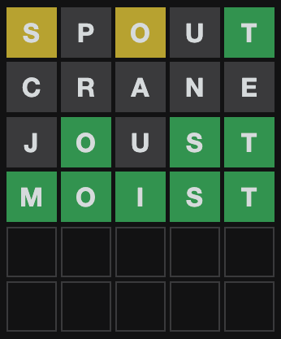
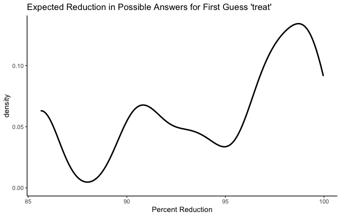

# Statistically-Optimal-Wordle

[Wordle](https://www.powerlanguage.co.uk/wordle/) is all the rage these days. If you're reading this, you probably already know the rules of the game. You get six guesses at a hidden five-letter word randomly selected each day. Each guess must itself be a legitimate five-letter word, and as feedback, you learn whether each letter in your guess is 1. in the target word and in the correct location (`green`), 2. in the target word but not in the correct location (`yellow`), or 3. not in the target word at all (`black`). 

This is my Wordle game from yesterday:



Around the Internet, strategy articles abound with titles like ["THE 20 BEST WORDLE STARTING WORDS ACCORDING TO SCIENCE"](https://www.inverse.com/gaming/wordle-starting-words-best-using-math), ["How to crack Wordle: 5-letter words to use first"](https://www.polygon.com/gaming/22884031/wordle-game-tips-best-first-guess-5-letter-words), and ["Best Wordle start words to help you win at Wordle"](https://www.tomsguide.com/news/best-wordle-start-words-to-help-you-win-every-time). 

Pretty much all of these articles are thinking about letter frequency; the best starting word is the one that has all the highest frequency letters in the dictionary. This is a pretty tempting way to go. In fact, if Wordle only told you whether or not each letter was in the target word, it might be pretty close to optimal. The thing is, Wordle also tells you about placement. If a letter is green, you know it's in that place. If it's yellow, you know it's not in that place. This is really valuable information and it would be a shame to throw it out. Unfortunately, it also makes the whole thing a lot more complicated.

As long as we're allowing computers to help us with this guessing game, let's try to get straight to the probabilities involved instead of stopping at frequencies and saying "good enough".

I went on a lot of long roadtrips as a kid, and the most popular game in our family car was "20 Questions". One person thinks of a specific thing--a species of animal, a place, a household appliance--and everyone else has to ask yes-or-no questions to try to guess what that person is thinking of. If they can't get it after 20 questions, the thinker wins. Anyone who has spent any time as a guesser in 20 Questions knows that you shouldn't actually start thinking about what the specific thing is until there are only two possible options of what it could be. Before that, your goal is to narrow down the possibilities as much as possible.

Since Wordle doesn't allow you to guess categories--only individual five-letter words--the narrowing-down game is much trickier than in 20 Questions. On the other hand, Wordle gives you a whole lot more feedback than a yes-or-no answer. Wheras in 20 Questions the optimal question narrows the possibilities by a half, in Wordle we should be able to do much better than that.

How much better? 

How good a guess is (i.e. how much does it narrow down the remaining possibilities) depends on what the actual answer is. For example, if your first guess is `treat` and the true answer is `tread`, you're only left with one possibility. There is only one word that begins with `trea-`and does not end in `t`, and it's `tread`. But it your first guess is `treat ` and the true answer is `boozy`, all you know is that the word doesn't include `a`, `e`, `r`, or `t`. 

Here's a little function that, for a given guess, true answer, and list of currently possible answers, will give you a narrowed-down list of possible answers based on Wordle's feedback on your guess.
``` r
  # input guess (5 item vector), answer (5 item vector), and prior dictionary (list of 5 item vectors)

dictionary_update <- function(guess, answer, dictionary) {
  for (n in 1:5) {
    if (guess[n] %in% answer){
      if (guess[n] == answer[n]) {
        dictionary <- dictionary[sapply(dictionary, "[", n) == guess[n]]
      }else{
        dictionary <- dictionary[sapply(dictionary, "[", n) != guess[n]
                                 & sapply(dictionary, function(x) any(guess[n] %in% x))]
      }
    }else{
      dictionary <- dictionary[sapply(dictionary, function(x) !any(guess[n] %in% x))]
    }
  }
  dictionary
}
```
So now we can give exact numbers. How many possibilities are left if your first guess is `treat` and the true answer is `boozy`?
``` r
dictionary_update(guess = unlist(strsplit("treat", "")), answer = unlist(strsplit("boozy", "")), dictionary = answer_dictionary)
```
The output list is 332 words long, beginning with `sissy`, `humph`, and `blush`. That's actually not too bad, given that Wordle's list of possible answers (as scraped from their website and represented above as "answer_dictionary") has 2,315 words. That's an 85.6% reduction!

This is all fine and lovely, but when we're playing Wordle, we don't know what the solution is. It could be `boozy` or `tread` or any of 2,313 others. So without knowing ahead of time what the solution is, how good of a guess is `treat`?

It's time to look at some probability distributions (well, density plots, but who's counting?).

``` r
# Function to create a dataframe with how much the given guess would narrow the possibilities for each possible answer.
guess_quality <- function(guess) {
  guess <- unlist(strsplit(guess, ""))
  distribution_table <- data.frame(answer = rep(NA, length(answer_dictionary)),
                                   posterior_dictionary_length = rep(NA, length(answer_dictionary)))
  for (n in 1:length(answer_dictionary)) {
    answer <- answer_dictionary[[n]]
    posterior_dictionary_length <- length(dictionary_update(guess, answer, answer_dictionary))
    distribution_table[n, 1] <- paste(answer, collapse = "")
    distribution_table[n, 2] <- posterior_dictionary_length
  }
  distribution_table
}

# Let's graph it!
library(tidyverse)

guess_quality_fast("treat") %>%
  mutate(
    dictionary_reduction = 100-(100*(posterior_dictionary_length/length(answer_dictionary)))
  ) %>%
  ggplot(aes(x = dictionary_reduction)) +
    geom_density(size = 1) +
    theme_classic() +
    labs(title = "Expected Reduction in Possible Answers for First Guess 'treat'",
         x = "Percent Reduction")
```



As anyone who has taken an introductory statistics course knows, the curve depicted above is most certainly *not* normal. On the whole, `treat` is clearly a good first guess, with the highest density of possible outcomes up toward 98% reduction, and the worst possible outcome around 85%. Presumably that's because about 85% of words in the Wordle dictionary include the letters `a`, `e`, `r`, or `t` and are therefore ruled out if the correct answer turns out not to include any of them.
In between the extremes though, it looks like you're very unlikely to get an 87% reduction, much more likely to get a 92% reduction, and then less likely again to get a 95% reduction.

That curve is so irregular that it makes me curious to see some more.

[This article](https://edition.cnn.com/2022/02/01/us/wordle-top-strategies-winning-words-cec/index.html) recommends starting with `adieu`.

