# Statistically-Optimal-Wordle

[Wordle](https://www.powerlanguage.co.uk/wordle/) is all the rage these days. If you're reading this, you probably already know the rules of the game. You get six guesses at a hidden five-letter word randomly selected each day. Each guess must itself be a legitimate five-letter word, and as feedback, you learn whether each letter in your guess is 1. in the target word and in the correct location (`green`), 2. in the target word but not in the correct location (`yellow`), or 3. not in the target word at all (`black`). 

This is my Wordle game from yesterday:


Around the Internet, strategy articles abound with titles like ["THE 20 BEST WORDLE STARTING WORDS ACCORDING TO SCIENCE"](https://www.inverse.com/gaming/wordle-starting-words-best-using-math), ["How to crack Wordle: 5-letter words to use first"](https://www.polygon.com/gaming/22884031/wordle-game-tips-best-first-guess-5-letter-words), and ["Best Wordle start words to help you win at Wordle"](https://www.tomsguide.com/news/best-wordle-start-words-to-help-you-win-every-time). 

Pretty much all of these articles are thinking about letter frequency; the best starting word is the one that has all the highest frequency letters in the dictionary. This is a pretty tempting way to go. In fact, if Wordle only told you whether or not each letter was in the target word, it might be pretty close to optimal. The thing is, Wordle also tells you about placement. If a letter is green, you know it's in that place. If it's yellow, you know it's not in that place. This is really valuable information and it would be a shame to throw it out. Unfortunately, it also makes the whole thing a lot more complicated. For example, I bet words with `t`s in the fifth place are better guesses than words with `t`s in the third place. Since more words in the dictionary have `t` in the fifth place, you'll rule out a lot more if it's not there, plus you're more likely to hit the jackpot with a green tile.

As long as we're allowing computers to help us with this guessing game, let's try to get straight to the probabilities involved instead of stopping at frequencies and saying "good enough".

I went on a lot of long roadtrips as a kid, and the most popular game in our family car was "20 Questions". One person thinks of a specific thing--a species of animal, a place, a household appliance--and everyone else has to ask yes-or-no questions to try to guess what that person is thinking of. If they can't get it after 20 questions, the thinker wins. Anyone who has spent any time as a guesser in 20 Questions knows that you shouldn't actually start thinking about what the specific thing is until there are only two possible options of what it could be. Before that, your goal is to narrow down the possibilities as much as possible.

Since Wordle doesn't allow you to guess categories--only individual five-letter words--the narrowing-down game is much trickier than in 20 Questions. On the other hand, Wordle gives you a whole lot more feedback than a yes-or-no answer. Wheras in 20 Questions the optimal question narrows the possibilities by a half, in Wordle we should be able to do much better than that.

How much better? 

How good a guess is (i.e. how much does it narrow down the remaining possibilities) depends on what the actual answer is. For example, if your first guess is `treat` and the true answer is `tread`, you're only left with one possibility. There is only one word that begins with `trea-`and does not end in `t`, and it's `tread`. But it your first guess is `treat ` and the true answer is `boozy`, all you know is that the word doesn't include `a`, `e`, `r`, or `t`. 

Here's a little function that, for a given guess, true answer, and list of currently possible answers, will give you a narrowed-down list of possible answers based on Wordle's feedback on your guess.
``` r
  # input guess (5 item vector), answer (5 item vector), and prior dictionary (list of 5 item vectors)

dictionary_update <- function(guess, answer, dictionary) {
  for (n in 1:5) {
    if (guess[n] %in% answer){
      if (guess[n] == answer[n]) {
        dictionary <- dictionary[sapply(dictionary, "[", n) == guess[n]]
      }else{
        dictionary <- dictionary[sapply(dictionary, "[", n) != guess[n]
                                 & sapply(dictionary, function(x) any(guess[n] %in% x))]
      }
    }else{
      dictionary <- dictionary[sapply(dictionary, function(x) !any(guess[n] %in% x))]
    }
  }
  dictionary
}
```
So now we can give exact numbers. How many possibilities are left if your first guess is `treat` and the true answer is `boozy`?
``` r
dictionary_update(guess = unlist(strsplit("treat", "")), answer = unlist(strsplit("boozy", "")), dictionary = answer_dictionary)
```
The output list is 332 words long, beginning with `sissy`, `humph`, and `blush`. That's actually not too bad, given that Wordle's list of possible answers (as scraped from their website and represented above as "answer_dictionary") has 2,315 words. Going from 2,315 possible answers before you start to 332 possible answers after the first guess is an 85.6% reduction!

This is all fine and lovely, but when we're playing Wordle, we don't know what the solution is. It could be `boozy` or `tread` or any of 2,313 others. So without knowing ahead of time what the solution is, how good of a guess is `treat`?

It's time to look at some probability density plots. 

``` r
# Function to create a dataframe with how much the given guess would narrow the possibilities for each possible answer.
guess_quality <- function(guess) {
  guess <- unlist(strsplit(guess, ""))
  distribution_table <- data.frame(answer = rep(NA, length(answer_dictionary)),
                                   posterior_dictionary_length = rep(NA, length(answer_dictionary)))
  for (n in 1:length(answer_dictionary)) {
    answer <- answer_dictionary[[n]]
    posterior_dictionary_length <- length(dictionary_update(guess, answer, answer_dictionary))
    distribution_table[n, 1] <- paste(answer, collapse = "")
    distribution_table[n, 2] <- posterior_dictionary_length
  }
  distribution_table
}

# Let's graph it!
library(tidyverse)

guess_quality_fast("treat") %>%
  mutate(
    dictionary_reduction = 100-(100*(posterior_dictionary_length/length(answer_dictionary)))
  ) %>%
  ggplot(aes(x = dictionary_reduction)) +
    geom_density(size = 1) +
    theme_classic() +
    labs(title = "Expected Reduction in Possible Answers for First Guess 'treat'",
         x = "Percent Reduction")
```
*Side note: The fact that all 2,315 possible answers are equally likely to be the true one makes this a whole lot easier. Some might say it means this endeavor is not technically "statistics". That's ok with me.*


Think of "density" here as the probability that, after your guess, you'll get a particular percent decrease in remaining possibilities. On the whole, `treat` is clearly a good first guess, with the highest density of possible outcomes up toward 98% reduction, and the worst possible outcome around 85%. Either way, you're ruling out the vast majority of possibilities. Presumably that's because about 85% of words in the Wordle dictionary include the letters `a`, `e`, `r`, or `t` and are therefore ruled out if the correct answer turns out not to include any of them.
In between the extremes though, it looks like you're very unlikely to get an 87% reduction, much more likely to get a 92% reduction, and then less likely again to get a 95% reduction.

That curve is so irregular that it makes me curious to see some more.

[This article](https://edition.cnn.com/2022/02/01/us/wordle-top-strategies-winning-words-cec/index.html) recommends starting with `adieu`.

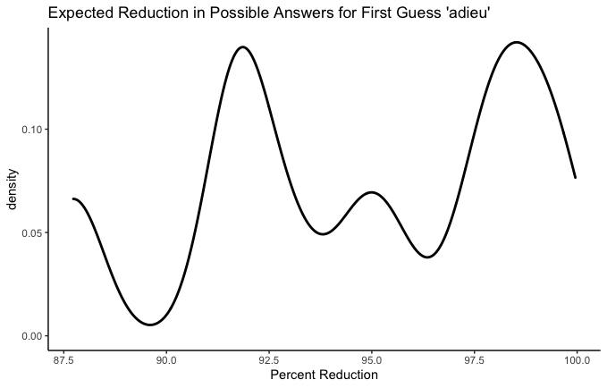

Huh. Two peaks. Looks like you have about equal chances of adieu being either a super super helpful guess or a measly very helpful guess. Your worst outcome is less likely, and is still not bad at 87.5%. 

What about a really terrible first guess?

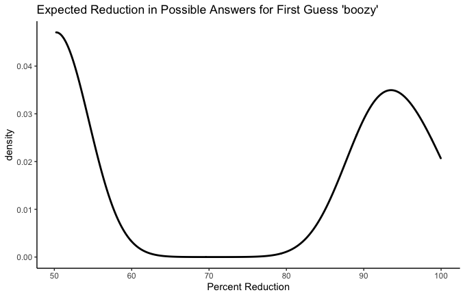

That about checks out. Your most likely single outcome here is that none of the letters of `boozy` are in the answer, in which case you've ruled out about half. But it's a coin flip, because there are some possible answers that are super similar to `boozy`, and if one of those is the answer you've made a lot of progress with your risky first guess.

I think the most interesting thing about these charts is the spread. Some guesses have a worst-case scenario that's actually pretty good, but above that it's a bit of a tossup. That's what we saw with `adieu`. On the other hand we saw `treat`, which is on the whole worse than `adieu` (and has a worse worst-case scenario) but which carries a greater probability of getting really close, with possibility reduction in the 98% range. Ok, maybe these aren't the best examples ever, but the point is: Are you playing for the best Wordle batting average or are you playing for a few really, spectacularly good games? In a few cases, it's possible that there's a high-stakes Wordle player would opt for the guess with the biggest mound all the way to the right of the graph, regardless of how long the tail is in the other direction.

Before moving on to real recommendations, I want to play with these graphs a little bit more. I claimed earlier that letter order matters a lot and that it's a mistake to reduce the best-first-guess problem to a letter frequency contest. Let's test that claim now.

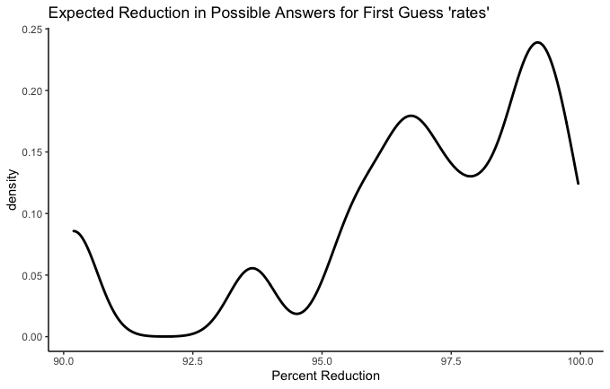 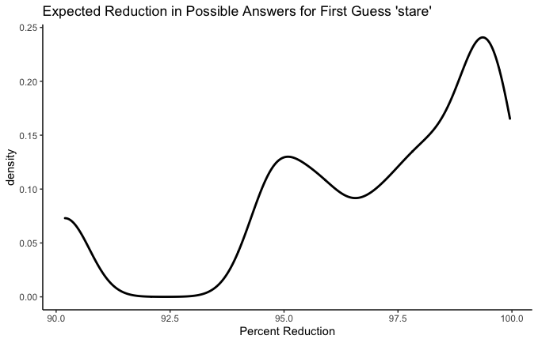
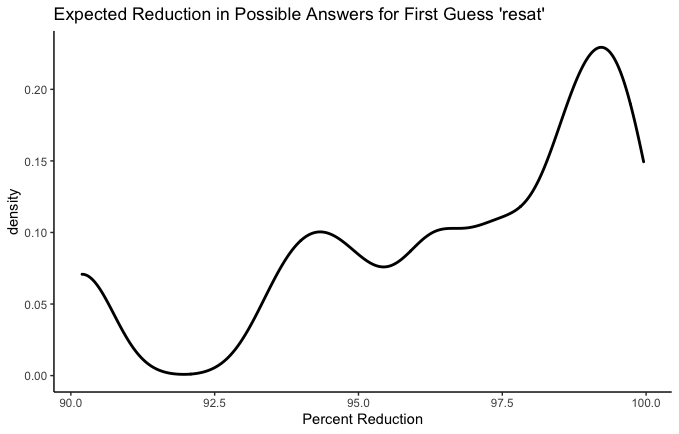 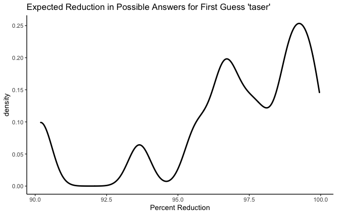

`rates`, `stare`, `resat`, and `taser` all have the same five letters. We can see that their worst-case scenarios are all identical. This makes sense - the worst case scenario is that none of those letters are anywhere in the word. But the curves above that worst-case scenario are different. Which is the best? A conservative Wordle player might wish to know which has the highest average reduction. In other words, how much does each guess narrow our possibilities down, on average? Let's see.

- rates: 96.83%
- stare: 96.92%
- resat: 96.72%
- taser: 96.92%

We could even add couple more obscure anagrams:

- aster: 96.63%
- tares: 96.91%

Ok fine, they're all pretty similar. But there is a difference! I think `e` in the fifth place is a big bonus--especially combined with `t`, `r`, and `s`-- since so many words end in -se, -te, or -re.

# What's the Best Starting Word?

Now we have our metric: What percentage of possible answers do we expect to rule out with this guess? All we have to do is apply this to every one of 12,972 legal guesses! (Yes, there are way more legal guesses than there are possible answers). 

The problem here is that for each one of those 12,972 legal guesses, the computer will have to test out 2,315 possible answers to see how helpful the guess is in each instance. 12,972 * 2,315 = 30,030,180. Combined with my lack of CS skills and my five-year-old computer, this amounts to a more waiting than I'd like. To speed this up a bit, let's only look at a random sample of 100 possible answers for each of the 12,972 guesses. It'll introduce a bit of randomness into the results, but we can fix that later.

``` r
# Faster guess assessment
guess_quality_fast <- function(guess) {
  guess <- unlist(strsplit(guess, ""))
  answer_sample <- answer_dictionary[sample(1:length(answer_dictionary), 100)]
  distribution_table <- data.frame(answer = rep(NA, length(answer_sample)),
                                   posterior_dictionary_length = rep(NA, length(answer_sample)))
  for (n in 1:length(answer_sample)) {
    answer <- answer_sample[[n]]
    posterior_dictionary_length <- length(dictionary_update(guess, answer, answer_dictionary))
    distribution_table[n, 1] <- paste(answer, collapse = "")
    distribution_table[n, 2] <- posterior_dictionary_length
  }
  distribution_table
}

# Make dataframe of expected answer narrowing
expected_reduction_table <- data.frame(guess = rep(NA, length(guess_dictionary)),
                                       expected_reduction = rep(NA, length(guess_dictionary)))
for (n in 1:length(guess_dictionary)) {
  guess <- paste(guess_dictionary[[n]], collapse = "")
  expected_reduction_table$guess[n] <- guess
  distribution_table <- guess_quality_fast(guess) %>%
    mutate(dictionary_reduction = 100-(100*(posterior_dictionary_length/length(answer_dictionary))))
  expected_reduction_table$expected_reduction[n] <- mean(distribution_table$dictionary_reduction)
}
```
Here are the worst first guesses:
``` r
expected_reduction_table <- expected_reduction_table %>%
  arrange(desc(expected_reduction))

tail(expected_reduction_table)

#>       guess           expected_reduction
#> 12967 yuppy           61.77192
#> 12968 immix           60.55162
#> 12969 kudzu           60.28942
#> 12970 fuffy           57.36328
#> 12971 jugum           56.97495
#> 12972 qajaq           56.40821
```
Here are the best first guesses: 
``` r
head(expected_reduction_table)

#>   guess           expected_reduction
#> 1 roate           97.78920
#> 2 irate           97.73002
#> 3 soare           97.62505
#> 4 later           97.47257
#> 5 ariel           97.42851
#> 6 arise           97.42462
```
Before we discuss these results, though, let's get rid of that randomness. I'm going to take just the top 200 results of our semi-randomized analysis and rerun it with the full set of possible answers. Unless the very best first guess somehow made it out of the top 200, this should give us the true, statistically optimal best guess.

``` r
guess_dictionary_top <- strsplit(head(expected_reduction_table$guess, n = 200), "")

expected_reductions_exact <- data.frame(guess = rep(NA, 200),
                                       expected_reduction = rep(NA, 200))
for (n in 1:200) {
  guess <- paste(guess_dictionary_top[[n]], collapse = "")
  expected_reductions_exact$guess[n] <- guess
  distribution_table <- guess_quality(guess) %>%
    mutate(dictionary_reduction = 100-(100*(posterior_dictionary_length/length(answer_dictionary))))
  expected_reductions_exact$expected_reduction[n] <- mean(distribution_table$dictionary_reduction)
}

expected_reductions_exact <- expected_reductions_exact %>%
  arrange(desc(expected_reduction))
head(expected_reductions_exact, 10)

#>     guess           expected_reduction
#>  1  roate           97.38987
#>  2  raise           97.36497
#>  3  raile           97.35072
#>  4  soare           97.30881
#>  5  arise           97.24727
#>  6  irate           97.24496
#>  7  orate           97.24014
#>  8  ariel           97.17980
#>  9  arose           97.14811
#>  10 raine           97.10341

```
There's been quite a bit of shifting around, but `roate` is still on top! [Roate](https://www.lawinsider.com/dictionary/roate), the cumulative net earnings after taxes available to common shareholders, adjusted for tax-affected amortization of intangibles, for the calendar quarters in each calendar year in a specified period of time divided by average shareholder’s tangible common equity! Notice also that roate's expected reduction has gone down since our randomly-sampled round, from 97.79% to 97.39%. This makes sense and is similar to regression toward the mean--the first set had some randomness and the most extreme results of that randomness were selected to be on top. The second set had no randomness and therefore no boost on the top end.

There you have it. The statistically optimal Wordle starting word is `roate`.

# Cmon, I wanna see the optimal Wordle playing Bot!

Ok fine. Here it is:

``` r
    # This is the same as dictionary_update, but it prints the outcome of the guess with nice colors
dictionary_update_printed <- function(guess, answer, dictionary) {
  for (n in 1:5) {
    if (guess[n] %in% answer){
      if (guess[n] == answer[n]) {
        dictionary <- dictionary[sapply(dictionary, "[", n) == guess[n]]
        cat(paste0("\033[48;5;46m", guess[n]))
      }else{
        dictionary <- dictionary[sapply(dictionary, "[", n) != guess[n]
                                 & sapply(dictionary, function(x) any(guess[n] %in% x))]
        cat(paste0("\033[48;5;226m", guess[n]))
      }
    }else{
      dictionary <- dictionary[sapply(dictionary, function(x) !any(guess[n] %in% x))]
      cat(paste0("\033[48;5;249m", guess[n]))
    }
  }
  dictionary
}

    # Returns average posterior dictionary length
guess_quality_minimal <- function(guess, dictionary = answer_dictionary) {
  guess <- unlist(strsplit(guess, ""))
  distribution <- rep(NA, length(dictionary))
  for (n in 1:length(distribution)) {
    answer <- dictionary[[n]]
    distribution[n] <- length(dictionary_update(guess, answer, dictionary))
  }
  mean(distribution)
}

  # THE BOT

play <- function(answer){
  stopifnot(length(answer) == 5)
  # Make the first guess (always "roate") and update the dictionary
  dictionary <- dictionary_update_printed(unlist(strsplit("roate", "")), answer, answer_dictionary)
  cat("\n")
  for (try in 1:5) {
    if (length(dictionary) == 1) {
      cat(paste0("\033[48;5;46m", paste(dictionary[[1]], collapse = "")))
      cat("\n")
      break
    }
    if (length(dictionary) == 2) {
      if (paste(guess_dictionary[[1]], collapse = "") == paste(answer, collapse = "")){
        dictionary <- dictionary_update_printed(dictionary[[1]], answer, dictionary)
        cat("\n")
        break
      }else{
        dictionary <- dictionary_update_printed(dictionary[[1]], answer, dictionary)
        dictionary <- dictionary_update_printed(dictionary[[1]], answer, dictionary)
        cat("\n")
        break
      }
    }
    guess_remainders <- rep(NA, length(guess_dictionary))
    for (n in 1:length(guess_dictionary)) {
      guess <- paste(guess_dictionary[[n]], collapse = "")
      guess_remainders[n] <- guess_quality_minimal(guess, dictionary)
    }
    dictionary <- dictionary_update_printed(guess_dictionary[[which.min(guess_remainders)]], answer, dictionary)
    cat("\n")
    if (paste(guess_dictionary[[which.min(guess_remainders)]], collapse = "") == paste(answer, collapse = "")) {
      break
    }
  }
}
```
Obviously the bot always starts by guessing "roate". After each new guess, the expected helpfulness of each possible next guess is reassessed based on the shortened list of answer possibilities. Other than that, the whole process is the same one I've been working with all along; each guess is the one that is expected to narrow down the remaining possibilities the most.

Let's see it play a few games!

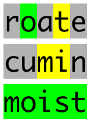 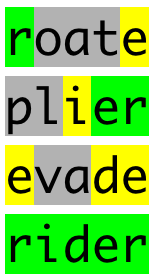 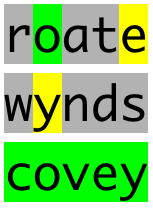
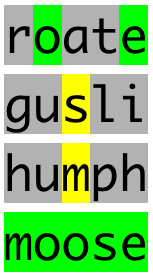 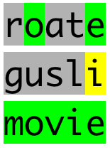 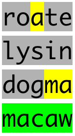 
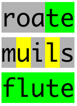 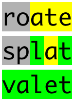


